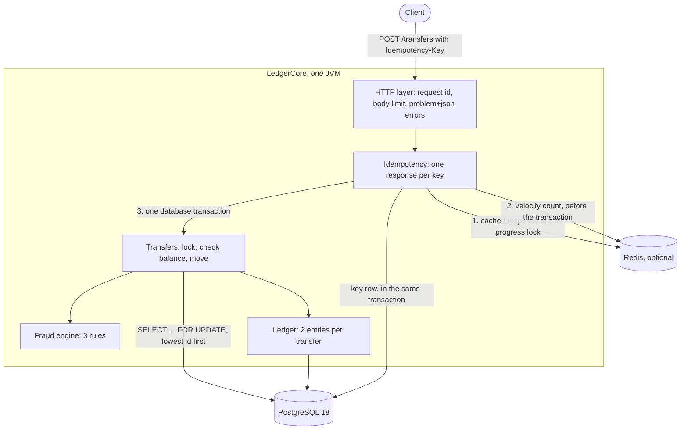

# LedgerCore

LedgerCore is a small payments ledger service. It keeps accounts, moves money between them with double-entry bookkeeping, makes transfer requests safe to retry, and checks every transfer with a few fraud rules before any money moves.

I built it to learn how a payment backend stays correct when many requests arrive at the same time. It is written in Java 21 with SparkJava, PostgreSQL, jOOQ, Flyway and Redis, and tested with Spock and Testcontainers.

## Results

Every number comes from a run in this repo. The links go to the test or the report it comes from.

- **No money lost or created in 1,000 concurrent transfers.** 50 threads send 1,000 transfers between 10 accounts. After that the balances still add up to the starting total, no balance is negative, and the ledger entries sum to zero. ([ConcurrentTransfersSpec](src/test/groovy/com/ledgercore/transfer/ConcurrentTransfersSpec.groovy))
- **p99 at 400 transfers per second went from 24 seconds or more to under 130 ms**, after I moved the Redis calls out of the database transaction. ([load test, before and after](docs/load-test.md#before-and-after-same-setup))
- **250 transfers per second at p95 9 ms** and p99 21 ms, median of three 2 minute runs on my laptop. Over four series the p99 median was between 21 and 32 ms. ([load test](docs/load-test.md#steady-load-1000-accounts-250s-3-runs-of-120-seconds))
- **Fraud declines have a 0.9% false positive rate** on 10,000 labeled synthetic transactions. They catch 13% of the fraud, and 18% when reviews are counted too. The data is synthetic and I made it knowing the rules, so this shows the rules work as designed, not how they would do on real fraud. ([fraud evaluation](docs/fraud-evaluation.md))
- **258 tests, 97.5% line coverage.** The build fails under 80%. (`./gradlew check`)

## Architecture



The code is packaged by feature: `account`, `transfer`, `ledger`, `idempotency`, `fraud`, `http` and `config`. There is no dependency injection framework. `App.java` creates every object by hand, so you can read the whole wiring in one method.

## API

| Method and path | What it does |
|---|---|
| `POST /accounts` | open a customer account with a zero balance |
| `GET /accounts/{id}` | one customer account with its balance |
| `GET /accounts/{id}/transactions` | the account's ledger entries, newest first, with cursor pagination |
| `POST /accounts/{id}/deposits` | add money, needs `Idempotency-Key` |
| `POST /transfers` | move money between two accounts, needs `Idempotency-Key` |
| `GET /transfers/{id}` | one transfer |
| `GET /health` | is the process alive |
| `GET /ready` | can it take traffic: checks the database, reports Redis |

The full description is in [docs/openapi.yaml](docs/openapi.yaml). Errors use `application/problem+json` (RFC 9457, which replaced RFC 7807) and carry the request id.

When the database can't be reached, the service answers 503 with `Retry-After: 1`. A 409 for a request that is still in progress has the same header. The funding accounts are internal, so `GET` on one answers 404.

## Design decisions

### Money is a whole number

An amount is a `long` in minor units (cents) plus an ISO 4217 currency code. I never use `float` or `double` for money, because they can't store 0.10 exactly. The JSON parser is strict too: `"100"` and `100.5` are rejected, not rounded.

Version 1 only moves money inside one currency. A transfer between a EUR and a GBP account gets a 422 with a clear message.

### Double-entry bookkeeping

Every transfer writes exactly two ledger entries in the same database transaction as the balance updates: minus the amount for the sender, plus the amount for the receiver. So the sum of all entries in a currency is always zero, and an account's balance is always the sum of its own entries.

Money enters through one system funding account per currency. A deposit is a normal transfer from that account, so it goes through the same code, the same locks and the same ledger entries. Only funding accounts may go below zero. Their negative balance is the total that was ever deposited.

Trade-off: I store the balance on the account and also the entries, which is the same fact twice. It makes reading a balance fast, and the load test checks after every run that the two still agree.

### Pessimistic locking, always in id order

A transfer locks both accounts with `SELECT ... FOR UPDATE`, checks the balance, then writes. The database also has a `CHECK` constraint, so a negative customer balance is impossible even if the code is wrong.

I chose pessimistic locking over optimistic locking because transfers often hit the same busy accounts. With a version column, every conflict throws the work away and retries it. With a lock, the second transfer waits a few milliseconds.

Two transfers in opposite directions (A to B and B to A) could deadlock: each holds one row and waits for the other. So I always lock the account with the lower id first. [LockOrderSpec](src/test/groovy/com/ledgercore/transfer/LockOrderSpec.groovy) shows both cases: in opposite order Postgres reports a deadlock, in id order it never does. When I removed the ordering from the code as an experiment, 310 of the 1,000 concurrent transfers failed with deadlocks.

Trade-off: a hot account is a bottleneck, because its transfers run one after another. With 10 accounts sharing 250 transfers per second the p99 was 53 ms instead of 21 ms. All deposits in one currency share one funding row, which is the worst case of this.

### Idempotency with Redis and the database

`POST /transfers` and deposits need an `Idempotency-Key` header. The same key always gives the same response, so a client can safely retry after a timeout.

- Redis is the fast path. `SET NX` with a TTL marks a key as in progress. A duplicate that arrives while the first request is still running gets a 409. A finished duplicate gets the saved response from Redis.
- The same key with a different request gets a 422. I compare a SHA-256 hash of the method, the path and the JSON body with sorted keys, so a retry with reordered fields still counts as the same request.
- PostgreSQL is the final guard. The key row is inserted in the same transaction as the transfer, and the key is the primary key. If Redis is down and two duplicates run at once, the second insert fails, its whole transaction rolls back, and it returns the response of the first.

A 404 or 422 is saved and replayed like a success. A 400 is not saved, so the client can fix the body and use the key again.

Trade-off: two stores to keep in step. I accept it because Redis is only a shortcut. The service is correct without it, and the tests stop Redis to prove that.

### Fraud rules

Before any money moves, three rules look at the transfer. Each one implements the same small interface, and the limits come from environment variables.

1. **Velocity**: more than 5 transfers from one account in 60 seconds. Decline.
2. **Amount**: above an absolute limit, decline. More than 10 times the account's usual amount, review.
3. **New recipient**: a large first payment to someone new. Review.

The strictest answer wins. Approve moves the money. Review saves the transfer as `PENDING_REVIEW` and answers 202, and no money moves. Decline answers 422 and keeps a row for audit. The response never says which rule fired, because that would tell a fraudster the limits.

The rules are plain functions over a few facts, so the same classes run in the service and in the offline evaluation.

Trade-off: rules are easy to explain and test, but they only catch what I thought of. Two of my four synthetic fraud patterns stay under every limit on purpose, and the rules catch none of those.

### No network calls inside the database transaction

This one I learned from the load test. The velocity rule counted attempts in Redis while the transfer's transaction was open. When Redis got slow for a moment, every transfer held its database connection longer, all 10 connections were busy, and up to 185 requests queued. At 400 transfers per second the p99 was 24 seconds or more.

I found it by sampling `pg_stat_activity` during the test: in slow seconds, 6 of the 10 connections were `idle in transaction`, which means Postgres was waiting for my code. Now the Redis calls run before the transaction opens, and the p99 at the same load is under 130 ms.

## Run it

You need Docker.

```bash
docker compose up --build
```

This starts PostgreSQL, Redis and the service on port 8080. Then, in another terminal:

```bash
# open two accounts
curl -s -X POST localhost:8080/accounts -H 'Content-Type: application/json' \
  -d '{"ownerName":"Alice","currency":"EUR"}'
curl -s -X POST localhost:8080/accounts -H 'Content-Type: application/json' \
  -d '{"ownerName":"Bob","currency":"EUR"}'

# the first three accounts are the funding accounts, so Alice is 4 and Bob is 5
curl -s -X POST localhost:8080/accounts/4/deposits -H 'Content-Type: application/json' \
  -H 'Idempotency-Key: deposit-1' -d '{"amount":10000}'

# move 25.00 EUR, then send the same request again: same response, money moves once
curl -s -X POST localhost:8080/transfers -H 'Content-Type: application/json' \
  -H 'Idempotency-Key: transfer-1' \
  -d '{"fromAccountId":4,"toAccountId":5,"amount":2500,"currency":"EUR"}'
curl -s -X POST localhost:8080/transfers -H 'Content-Type: application/json' \
  -H 'Idempotency-Key: transfer-1' \
  -d '{"fromAccountId":4,"toAccountId":5,"amount":2500,"currency":"EUR"}'

curl -s localhost:8080/accounts/4
curl -s localhost:8080/accounts/4/transactions
```

All settings come from environment variables: `PORT`, `DATABASE_URL`, `DATABASE_USER`, `DATABASE_PASSWORD`, `DATABASE_POOL_SIZE` (10 if not set), `REDIS_URL` (optional), `REDIS_TIMEOUT_MS` (500 if not set) and the `FRAUD_*` limits. A value that is not a positive whole number stops the service at startup with a clear message.

## Test it

```bash
./gradlew check
```

This needs Docker, because the specs run against a real PostgreSQL and a real Redis in Testcontainers. It also checks the coverage threshold and compiles the load test. The build uses a Java 21 toolchain and downloads it if you don't have one.

```bash
./gradlew fraudEvaluation      # writes docs/fraud-evaluation.md, same seed, same numbers
```

The load test starts its own databases and takes a few minutes per series. See [docs/load-test.md](docs/load-test.md) for how to run it.

## Measured results

| What | Result |
|---|---|
| Tests | 258, all passing |
| Coverage | 97.5% of lines, 93.5% of branches (generated jOOQ code not counted) |
| 250 transfers/s, 1,000 accounts | p50 4 ms, p95 9 ms, p99 21 ms, no failures (median of 3 runs of 120 s) |
| 250 transfers/s, only 10 accounts | p50 4 ms, p95 13 ms, p99 53 ms, no failures |
| Limit on this laptop | keeps up at 500/s, falls behind at 600/s |
| 400 transfers/s, Redis inside the transaction | p99 24,401 ms and 40,422 ms (2 runs) |
| 400 transfers/s, Redis before the transaction | p99 50 ms and 127 ms (2 runs) |
| Money checks after load | all zero after each of 20 runs, 522,228 transfers |
| Fraud rules, review or decline | recall 18.2%, precision 17.8%, false positive rate 4.4% |
| Fraud rules, decline only | recall 13.0%, precision 44.2%, false positive rate 0.9% |

Hardware and software for the load test: Apple M1 with 8 cores and 8 GB RAM, macOS 14.2.1, Docker Desktop 29.8.0 (8 CPUs, 3.8 GiB), Temurin 21.0.12.1 with a 512 MB heap, PostgreSQL 18.6, Redis 7.4.11. The load generator ran on the same laptop, so these are lower bounds for this machine, not server numbers.

At 1,000 requests per second, 1,267 of 30,000 requests failed. None of them was an error answer from the service: Gatling and the service both ran out of file handles on macOS. The details are in [docs/load-test.md](docs/load-test.md).

## Deploy

[docs/deploy.md](docs/deploy.md) has every command to run it on Google Cloud Run with Cloud SQL for PostgreSQL 18. It costs about $9.45 a month, and the guide starts with a budget alert. The service is deployed without public access, because the API has no login of its own. The repo also has Kubernetes manifests in [k8s/](k8s/).

I deployed it once, and it worked: `/ready` was up, a request without a token got a 403, and a deposit and a transfer went through. Three things went wrong on the way, and the guide now covers them:

1. The project had no billing account linked, so turning on the APIs failed.
2. Creating the budget from the command line failed, so I made it in the console.
3. My first deploy could not reach the database. In zsh, `$REGION:l` means "lowercase", so the shell ate a letter of the connection name. Now every variable in the guide has braces.

## Known limits

These are the limits of version 1 that I know about.

- **`POST /accounts` is not idempotent.** It takes no `Idempotency-Key`, so a retry after a timeout opens a second account. A new account is empty, so no money is at risk, but the client ends up with one account it doesn't need.
- **The fraud facts are read before the accounts are locked.** I do this to keep the locks short. The cost: two transfers from the same account at the same moment can be judged on the same history, so the second one doesn't see the first. The balance check is not affected, because it runs under the lock.
- **`/ready` shares the connection pool with the traffic.** When all 10 connections are busy, the readiness check waits in the same queue. Under heavy load it can time out, and the instance is taken out of rotation when it is only busy.
- **SparkJava 2.9.4 runs on Jetty 9.4.** Spark pins Jetty 9.4.48 from June 2022. The build forces the last 9.4 release, 9.4.58, so the security fixes that came after 9.4.48 are in. Jetty 9.x reached the end of its community support in June 2022, so replacing Spark is still the real fix. I kept it for version 1. Responses don't name the server or its version. Dependabot checks the dependencies every week.

## What I'd do next

- **FX**: transfers between currencies, with a rate and two more ledger entries through an exchange account.
- **Outbox pattern**: write an event in the same transaction as the transfer and publish it afterwards, so other services can follow the ledger.
- **Compare with optimistic locking**, using the same load test, to see where each one wins.
- **Compare the rule engine with an ML model**, for example gradient boosting, trained on the same labeled data and evaluated on a fresh seed.
- **A review workflow** for `PENDING_REVIEW` transfers: approve, reject, and hold the money in the meantime.
- **Hot accounts**: all deposits lock one funding row per currency. Several funding rows would spread that load.
- **Public ids**: accounts and transfers use sequential numbers, which show how many exist. I would expose UUIDs instead.
- **Login and permissions** for the API, IAM authentication for the database, and a private IP for Cloud SQL.
- **405 with an `Allow` header** for a wrong method. Today that is a 404.
- **Clean up old idempotency keys** in the database. Today they stay forever.
- **Load test on Linux**, with the service inside the Docker network, to measure without the macOS port forward.
- **Replace SparkJava**: it is no longer actively developed and pins Jetty 9.

## License

[MIT](LICENSE)
